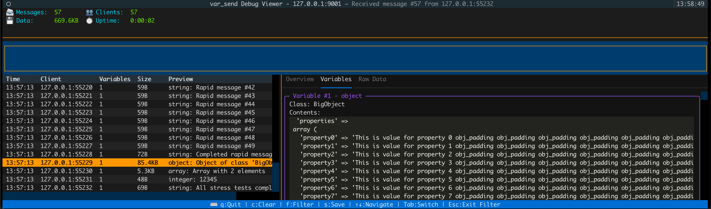

# var_send PHP Extension

A PHP extension that acts like `var_dump()` but sends data to a TCP server for remote debugging.

## Overview

The `var_send` extension provides a function similar to PHP's built-in `var_dump()`, but instead of outputting the variable information to the standard output, it sends it to a TCP server. This is particularly useful for:

- Debugging API endpoints where you can't have output in the response
- Collecting debug information from multiple sources in complex ecosystems

## Installation

### Prerequisites

- PHP development environment (php-dev)
- Autoconf, make, gcc, and other build tools

### Build and Install

#### Quick Install (Recommended)

Use the provided install script for automatic setup:
```bash
./install.sh
```

#### Manual Installation

1. Prepare the build environment:
   ```
   phpize
   ```

2. Configure and build:
   ```
   ./configure --enable-var-send
   make
   ```

3. Install:
   ```
   sudo make install
   ```

4. Add the extension to your php.ini file:
   ```
   extension=var_send.so
   ```

## Configuration

The extension can be configured through php.ini settings:

- `var_send.server_host` - The hostname or IP address of the TCP server (default: "127.0.0.1")
- `var_send.server_port` - The port number of the TCP server (default: 9001)
- `var_send.enabled` - Enable or disable the extension (default: 1)

Example:
```ini
var_send.server_host = "192.168.1.100"
var_send.server_port = 9002
var_send.enabled = 1
```

## Usage

Using the extension is straightforward:

```php
// Send a single variable to the TCP server
var_send($variable);

// Send multiple variables
var_send($var1, $var2, $array, $object);
```

The extension will automatically include the file and line number in the sent data, making it easier to trace where the debug information came from.

## Debug Viewers

Two debug viewers are provided to receive and display var_send data:

### Python Debug Viewer (Recommended)

Interactive terminal UI application with advanced features:



**Features:**
- Terminal interface with tabbed content
- Real-time message filtering and search
- Message statistics and client tracking
- Multi-variable support with inspection

**Installation:**
```bash
# Setup debug viewer dependencies
./setup_viewer.sh

# Start the viewer
python debug_viewer.py
```

**Usage:**
```bash
# Default (listens on 127.0.0.1:9001)
python debug_viewer.py

# Custom host/port
python debug_viewer.py --host 0.0.0.0 --port 9002
```

### Simple PHP Debug Server

A basic console-based debug server for simple debugging needs:

```bash
php debug_server.php
```

This server listens on 0.0.0.0:9001 and displays received debugging information directly to the console.

## Example

```php
$user = [
  'id' => 123,
  'name' => 'John Doe',
  'email' => 'john@example.com',
  'roles' => ['admin', 'editor']
];

// Send user data to the debug server
var_send($user);

```

## License

MIT License
